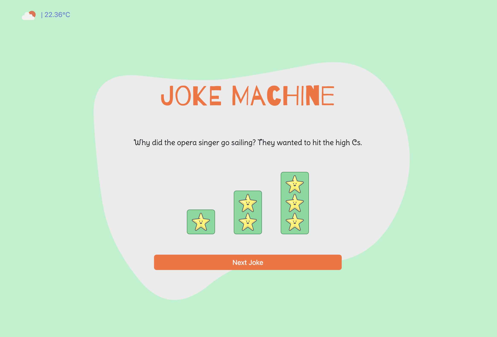

# Joke-machine-API



## Sprint Description

Development of a **joke website** using **Bootstrap 5**, **SASS**, **TypeScript**, and **JavaScript**. Calls were made to two joke APIs and one API to retrieve the weather in Barcelona.

## Technologies and Tools Used

- **HTML, SASS, Bootstrap 5, TypeScript and JavaScript**
- **IT Academy - Sprint 4 Documentation**
- **[Bootstrap 5](https://getbootstrap.com/)** - CSS Framework
- **[TypeScript](https://www.typescriptlang.org/es/docs/)** - Documentation
- **[Google Font](https://fonts.google.com/)** - Fonts
- **[Blob Generator](https://www.magicpattern.design/tools/blob-generator)** Generator Blob
- **[Free Icons](https://freeicons.io)** - Icons
- **[RapidApi](https://rapidapi.com/)** - APIs

## Requirements

- **Modern browser**: Chrome, Firefox, Safari, Edge.
- **Code editor**: VS Code, Sublime Text (to edit or view the code).

## Developer Prerequisites (Optional)

To understand or modify the code, you should have:

- **Basic knowledge of HTML, SASS, Bootstrap 5, TypeScript and JavaScript.**

## Installation

1. Clone the repository:

   ```bash
   git clone https://github.com/VictorGonPe/Joke-machine-API.git
   ```

   ```bash
   cd Joke-machine-API
   ```

2. Install dependencies (SASS, TypeScript, Vite, etc.):

   ```bash
   npm install
   ```

3. Run the development environment in **separate terminals**:

   ```bash
   npm run dev
   npm run sass:watch
   npm run tsc:watch
   ```

4. Open the project in a code editor.

5. Set up Environment Variables

   Create a .env file at the root of the project with the following variables:

   ```env
   VITE_API_KEY_WEATHER=your_weather_api_key
   VITE_API_KEY_JOKE=your_joke_api_key
   ```

   These API keys are required to fetch data from the weather and joke services.
   You can obtain them from RapidAPI.

   The API endpoints and usage logic are located in the file src/api-data.ts.

## Execution

### **Option 1**: Open directly in the browser

- Navigate to the project folder and open **index.html**.

### **Option 2**: Use Vite Server

- Run `npm run dev` in the terminal.
- Open the local development URL shown in the terminal (e.g. `http://localhost:5173/`)
